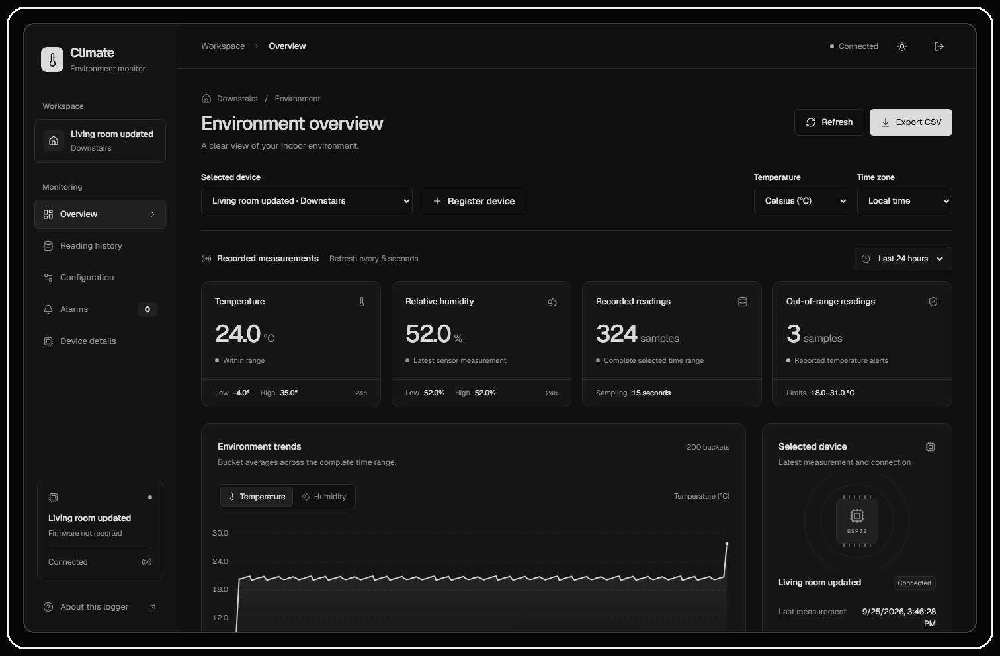
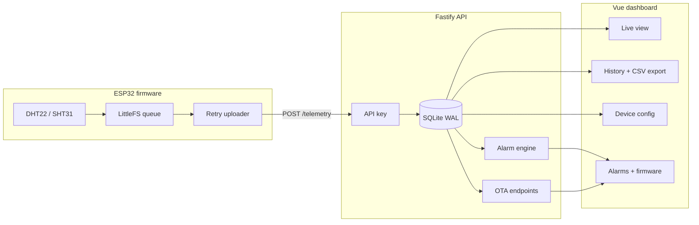

<p align="center">
  
</p>

<p align="center">
  <strong>Self-hosted ESP32 climate monitoring.</strong><br />
  Firmware, API, SQLite, alarms, OTA, and a clean realtime dashboard.
</p>

<p align="center">
  <a href="LICENSE"></a>
  
  
  
  
</p>

<p align="center">
  <a href="#quick-start">Quick start</a>
  · <a href="#features">Features</a>
  · <a href="#firmware">Firmware</a>
  · <a href="#configuration">Configuration</a>
  · <a href="#api">API</a>
  · <a href="#docs">Docs</a>
</p>

---

<p align="center">
  
</p>

## What it does

Climate reads temperature and humidity from ESP32 devices, stores history in SQLite, and gives you a clean dashboard to monitor, get alerted, and manage firmware updates. Built for homes, labs, greenhouses, and local sensor networks.

## Quick start

```bash
cd webapp
npm install
npm run dev
```

| Service | URL |
|---|---|
| Dashboard | http://localhost:5173 |
| API | http://localhost:3000 |
| Health check | http://localhost:3000/health |

First run: choose password or no-password mode → provision device API key if private → flash firmware → monitor readings.

## Features

| Area | Details |
|---|---|
| **Sensors** | DHT22 and SHT31 build targets |
| **Power modes** | Always-on and deep-sleep firmware |
| **Offline safety** | LittleFS queue, CRC records, retry, replay-safe dedup |
| **Storage** | SQLite WAL, online backup, CSV export |
| **Auth** | API keys |
| **Alerts** | Alarms, notifications, heartbeat diagnostics |
| **OTA** | Firmware metadata + binary download endpoints |
| **Dashboard** | Responsive charts, filters, auto dark/light theme |

## Architecture



## Firmware

```bash
cd firmware
cp platformio.secrets.ini.example platformio.secrets.ini
pio run -e lolin32_dht22_alwayson --target upload
```

| Target | Sensor | Mode | When to use |
|---|---|---|---|
| `lolin32_dht22_alwayson` | DHT22 | Always-on | Wall-powered, existing DHT22 |
| `lolin32_sht31_alwayson` | SHT31 | Always-on | Better sensor on wall power |
| `lolin32_dht22_deepsleep` | DHT22 | Deep sleep | Battery, existing DHT22 |
| `lolin32_sht31_deepsleep` | SHT31 | Deep sleep | Recommended battery path |
| `compile_test_ota` | DHT22 | Compile-only | Verify OTA, do not flash |

> [!NOTE]
> ESP32 cannot reach your laptop via its `localhost`. Use your LAN IP, e.g. `http://192.168.x.x:3000/api/v1/telemetry`. In Wokwi, use `http://host.wokwi.internal:3000/api/v1/telemetry`.

## Configuration

### Web app

```bash
cd webapp && cp .env.example .env
```

| Variable | Default | Purpose |
|---|---|---|
| `HOST` | `127.0.0.1` | API bind host |
| `PORT` | `3000` | API port |
| `DATABASE_PATH` | `./apps/api/data/climate.sqlite` | SQLite database file |
| `DASHBOARD_ORIGIN` | `http://localhost:5173` | Allowed dashboard origin |

### Firmware

```bash
cd firmware && cp platformio.secrets.ini.example platformio.secrets.ini
```

| Variable | Purpose |
|---|---|
| `WIFI_SSID` | Wi-Fi name |
| `WIFI_PASSWORD` | Wi-Fi password |
| `DEVICE_ID` | Stable device ID |
| `API_URL` | Telemetry endpoint |
| `API_KEY` | API key for device auth |

## API

| Endpoint | Auth | Purpose |
|---|---|---|
| `/health` | None | Health check |
| `/api/v1/auth/*` | Session | Owner setup, login |
| `/api/v1/telemetry` | Device API key or public mode | Ingest sensor data |
| `/api/v1/readings` | Session | Query history |
| `/api/v1/devices` | Session | Device registry |
| `/api/v1/alarms` | Session | Alarm workflow |
| `/api/v1/firmware/*` | Device API key | OTA endpoints |

<details>
<summary>Project structure</summary>

```text
climate/
├── firmware/                  # ESP32 PlatformIO firmware
│   ├── src/app/               # Entry points (always-on, deep-sleep)
│   ├── src/config/            # Config and secrets template
│   ├── src/platform/          # Runtime, OTA, deep sleep, CLI
│   ├── src/sensors/           # DHT22/SHT31 adapter + filtering
│   ├── src/storage/           # Reliability queue + CRC
│   └── src/telemetry/         # HTTP publisher + wire protocol
├── webapp/
│   ├── apps/api/              # Fastify + SQLite backend
│   └── apps/dashboard/        # Vue + Vite dashboard
├── docs/assets/               # Logo and dashboard screenshot
└── README.md
```

</details>

<details>
<summary>Verification commands</summary>

```bash
cd webapp
npm run build
npm test
cd apps/dashboard && npm run test:browser

cd ../../firmware
pio run -e lolin32_dht22_alwayson -e lolin32_sht31_alwayson \
        -e lolin32_dht22_deepsleep -e lolin32_sht31_deepsleep \
        -e compile_test_ota
```

</details>

## Status

| Check | Result |
|---|---|
| API tests | 16 pass, 0 fail |
| Browser QA | Pass |
| Web build | Pass |
| Firmware matrix | Pass |
| Wokwi image | Generated |

## Firmware

Climate ships universal ESP32 firmware (ESP-IDF, PlatformIO) that works with any compatible API backend. It is decoupled from the dashboard: set `API_URL` and `API_KEY` to report, or leave it unconfigured for local flash/QC.

| Capability | Climate | ESPHome | Tasmota |
|---|---|---|---|
| Configuration | Single `platformio.secrets.ini` | Per-device YAML file | Web UI commands |
| Build | Per-sensor-matrix (`dht22`/`sht31`, `alwayson`/`deepsleep`) | Per-device compilation | Shared binary |
| Local queue | LittleFS, CRC records, replay-safe dedup | RAM queue | Flash queue |
| Offline safety | Retry uploader, CRC, dedup | Limited retry | Rules + retain |
| OTA updates | Climate API or standalone HTTPS | ESPHome/HA | Tasmota web/MQTT |
| Auth model | `API_KEY` BEARER token per device | Native API key | None (MQTT) |
| Flash usage | 75–78% | ~65% | ~90% |
| For beginners | ⚠️ Needs API backend | ⚠️ YAML compile | ✅ Web UI install |
| Standalone use | Needs API | HA preferred | ✅ Self-contained |
| Flexibility | Medium (matrix) | High (YAML) | High (rules) |

Climate is for small self-hosted deployments: homes, labs, greenhouses, fridges, sensor networks. Not for large-fleet telemetry or enterprise RBAC.

| Limit | Impact |
|---|---|
| DHT22 accuracy | Use SHT31 for production-grade readings |
| SQLite scale | Not sized for large fleet storage |
| Auth model | Single-owner dashboard, not enterprise RBAC |
| Hardware proof | Build tests don't replace field testing |

## Contributing

Fork + PR welcome. Open an issue first for large changes.

## License

MIT. Use it, modify it, self-host it.
