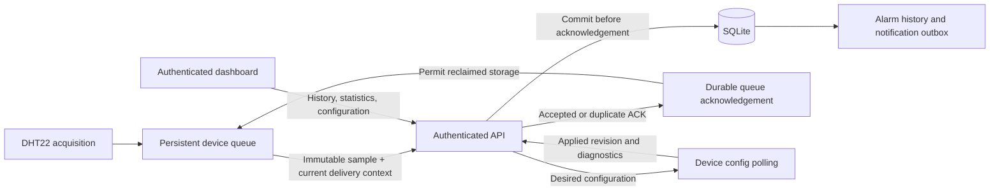

# Climate operations and acceptance guide

## What is being verified

This system records a DHT22 sensor on a WEMOS LOLIN32, sends acknowledged telemetry to a Fastify API, persists it in SQLite, and presents authenticated measurements, history, configuration and alarms in a Vue/shadcn-vue dashboard.

Software verification is separate from physical qualification. A successful build does not establish sensor accuracy, flash endurance, uninterrupted runtime, or successful recovery from power loss during a real flash operation.



## Local development

Prerequisites: Node.js 24+, pnpm, PlatformIO for firmware; a native C++ compiler or the documented portable test compiler for firmware host tests.

1. From `webapp/`, install dependencies with `pnpm install` (use `pnpm.cmd` in PowerShell if script execution is restricted).
2. Run `pnpm --filter api dev` and `pnpm --filter dashboard dev` in separate terminals.
3. Open the dashboard, create the initial administrator password locally, then sign in.
4. Register a device or use the existing Living Room entry. Device credentials authenticate only device ingestion/configuration, not dashboard access.
5. Configure the firmware's private settings using `firmware/README.md`. A physical ESP32 must use the computer's LAN address or a reachable domain; its `localhost` is the ESP32 itself. Wokwi needs its supported gateway route.
6. Build and follow the firmware's explicit flash/migration instructions. Never erase storage to resolve a connection problem.

The API binds to `127.0.0.1` by default. For a physical board on a trusted LAN, set `HOST=0.0.0.0` explicitly and allow the API port through the host firewall for that network. Use the computer's LAN address in the firmware. Do not expose the development setup endpoint to an untrusted network before creating the administrator.

## Credentials and network boundaries

- Initial administrator setup is a one-time local action. Passwords are not stored in the dashboard or included in exported measurements.
- A device token is shown once when created or rotated. Store it outside source control. Rotation requires updating the corresponding device before it can reconnect.
- Development compatibility credentials are only for a private local setup. Use explicit strong deployment credentials and HTTPS for production.
- Configure the exact dashboard origin; do not open wildcard credentialed CORS. Keep API listener private behind a TLS reverse proxy for internet access.
- Firmware must trust the correct certificate authority for HTTPS. Do not work around a certificate failure by disabling validation.
- Notification delivery is opt-in operator configuration. The test suite uses a local receiver. No real recipient is contacted merely by building/testing the project.

## Measurement meaning

- `sampledAt` is the measurement timestamp when the device has a trustworthy clock. `timeQuality` identifies synchronized, estimated or receipt-time fallback timestamps.
- `receivedAt` is the API arrival time. Offline replay can arrive later than newer measurements.
- A boot ID and sequence identify one immutable measurement. Retrying delivery must not create another row; restarting the board must not collide with a previous boot.
- `delivery.bootId` and `delivery.uptimeMs` describe the current transmission attempt. They may change during retries and are excluded from the stored measurement identity. An unsynchronized reading from an earlier boot, an old queued reading, or a modern reading without reliable delivery timing is retained as history without changing the current reading or measurement alarms.
- Filtered values reduce short-term fluctuations but do not calibrate a sensor. Compare against a trusted reference and record calibration offsets when needed.
- Historical charts may contain bucket averages. Use the raw log/CSV for individual readings and the min/max values to inspect excursions.
- Desired configuration is what the server requests. Applied configuration is the revision reported by the firmware. A saved form is not proof that an offline board has received it.
- A device heartbeat proves software connectivity, not a healthy sensor. Recent telemetry, sensor failures and clock quality must be interpreted separately.

## Data preservation

- Keep SQLite database files on persistent storage with sufficient free disk space and restricted OS permissions.
- WAL mode uses companion files while running. Use SQLite's online backup API or stop the API cleanly before taking a file backup; copying only the live main database is unsafe.
- Test restoring a backup into a separate database path and verify counts/time ranges before replacing production data.
- Queue capacity is finite. Monitor queue depth, dropped-record counters and filesystem errors; no finite microcontroller can retain measurements through an unlimited outage.
- Retain and inspect failed notification deliveries. A configured webhook is not proof that its recipient received an alarm.

### Online backup and restore check

Run from `webapp/apps/api` using the same `DATABASE_PATH` environment as the running API:

```sh
pnpm backup /absolute/path/to/climate-backup.sqlite
```

The command uses SQLite's online backup API and refuses to overwrite an existing destination. Choose a new filename for each backup. To check a restore, start a separate API with `DATABASE_PATH` pointing to a copy of the backup and a different `PORT`; verify the device registry, record count and time range before changing the production service. Keep backups private: they contain measurements and credential hashes. Schedule and retain backups according to the installation's storage and recovery needs.

## Qualification matrix

| Scenario | Acceptance condition | Verification level |
| --- | --- | --- |
| API restart | All acknowledged measurements remain queryable | Automated disk database integration |
| Replayed packet | One row, stable acknowledgement | Automated API |
| Board restart | New boot accepted despite repeated sequence numbers | Automated identity + physical board |
| Invalid/conflicting packet | Clear rejection, no existing data overwritten | Automated API |
| Wi-Fi/server outage | Acquisition continues, queued data retained and replayed | Native queue tests + physical network outage |
| Queue full/storage error | Failure counter/status increases; no silent loss | Native logic + physical flash test |
| Power loss mid-write | Incomplete record detected; committed records recovered | Host fault model + physical power interruption |
| DHT disconnected | No fake measurement; failed sensor visible | Host logic + physical disconnection |
| Sensor retry | New read respects DHT22 minimum interval | Code/test + hardware timing |
| Invalid clock | Timestamp quality reflects uncertainty | Automated protocol + board without time server |
| Configuration edit | Validation, persisted desired version, applied version follows | API/browser + physical board |
| Alarm transition | One event per transition; acknowledge does not fabricate recovery | Automated API/browser |
| Historical replay | Does not regress current device state or reopen old alarms | Automated API |
| Unauthorized user/device | No protected reads or cross-device writes | Automated security tests |
| OTA invalid certificate/hash | Update rejected, running image preserved | Code/native checks + physical OTA |
| OTA interrupted/bad image | Recovery follows documented bootloader capabilities | Physical fault-injection required |
| Extended operation | Measure missed samples, restarts, heap and latency for at least 72 hours | Physical soak test |
| Sensor accuracy | Compare readings against a reference over intended operating range | Physical calibration |

See the archived validation report at `.archive/tasks/final-report.md` for the tests actually executed. Items requiring hardware must not be marked passed based on simulation or compilation.

## Continuous verification

`.github/workflows/verify.yml` defines independent webapp and firmware checks for pushes, pull requests and manual runs. The webapp job uses Node24, installs the workspace lockfile, compiles both apps, runs API regressions, an abrupt server restart check and Chromium browser integration. The firmware job compiles LOLIN32 and runs the native tests with PlatformIO6.1.19. Jobs have read-only repository permissions and do not deploy or use private device credentials.

After building the API, run `node scripts/system-check.mjs` from the project root for the process-level check. It starts the compiled server on loopback with its own temporary SQLite database, creates a test owner, sends telemetry, kills and restarts the process, then checks persisted sessions/configuration, duplicate acknowledgement, new boot identity, historical replay isolation and CSV. It also sends the actual C++ serializer fixture and checks diagnostic values and replay acknowledgement. It removes only its own temporary fixture; the normal data directory and environment credentials are not used.

This workspace has no Git remote. The workflow is a prepared configuration; a hosted CI run has not occurred here. Local command results are recorded separately. The workflow pins the official [checkout](https://github.com/actions/checkout), [setup-node](https://github.com/actions/setup-node) and [setup-python](https://github.com/actions/setup-python) actions to their verified release commits. Native tests follow PlatformIO's [host testing support](https://docs.platformio.org/en/stable/advanced/unit-testing/index.html).
